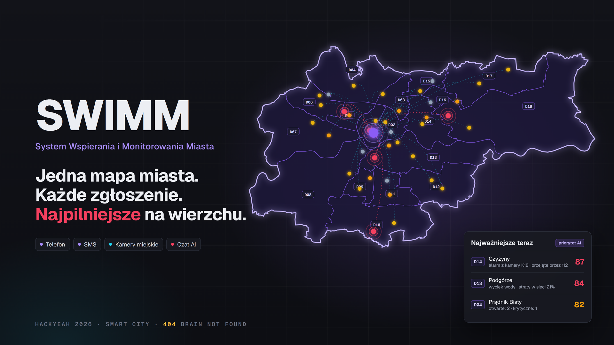

# SWIMM - System Wspierania i Monitorowania Miasta



**Jedna mapa miasta. Każde zgłoszenie. Najpilniejsze na wierzchu.**

Projekt zespołu **404 Brain Not Found** na HackYeah 2026 (zadanie SMART CITY).

Mamy własny serwer: https://swim.szubzdadev.pl/centrum

## O co chodzi

Mieszkańcy zgłaszają problemy na wiele sposobów: telefonem, SMS-em, w czacie albo formularzem. Do tego dochodzą kamery miejskie. W urzędzie te zgłoszenia trafiają w różne miejsca, nie ma ich na wspólnej mapie i nikt nie układa ich od najpilniejszego.

SWIMM zbiera wszystko na jednej mapie miasta dla dyspozytora urzędu:

- **Zgłoszenia z wielu kanałów i z kamer.** Każde dostaje kategorię, dzielnicę, jednostkę i priorytet.
- **Ranking dzielnic.** Od razu widać, gdzie dzieje się najwięcej.
- **Zasoby miasta.** Woda, energia, odpady i ciepło dla każdej dzielnicy. AI łączy pomiary ze zgłoszeniami, np. straty wody w sieci z wyciekiem zgłoszonym przez mieszkańców.
- **Alarmy krytyczne.** Na przykład kamera widzi osobę, która zasłabła. Alarm przychodzi z nagraniem, statusem służb 112 i podpowiedzią, co może zrobić miasto.

Demo działa na Krakowie (18 dzielnic) i Kielcach. Zgłoszenia, kamery i pomiary w demo są fikcyjne.

## Jak uruchomić

Potrzebny jest tylko zainstalowany [Docker](https://www.docker.com/products/docker-desktop/).

```bash
git clone https://github.com/rtekdev/404-Brain-Not-Found.git
cd 404-Brain-Not-Found/website
docker compose up --build
```

Potem otwórz w przeglądarce:

- **http://localhost:3000** - strona dla mieszkańców,
- **http://localhost:3000/centrum** - mapa dla urzędu (tu jest całe demo).

Zatrzymanie: `docker compose down`. Powrót do danych startowych: `docker compose down -v`, a potem znowu `docker compose up --build`.

Czat AI na stronie głównej odpowiada dopiero po wpisaniu klucza `ANTHROPIC_API_KEY` do pliku `website/.env`. Reszta aplikacji działa bez niego.

## Więcej

- [Scenariusz demo](docs/SCENARIUSZ_DEMO.md) - co kliknąć na prezentacji, krok po kroku.
- [Architektura](docs/ARCHITEKTURA.md) - jak to jest zbudowane.

Stos: Next.js 16, PostgreSQL 17, MapLibre GL, OpenStreetMap oraz zewnętrznie podpięte ElevenLabs i n8n.

ElevenLabs i n8n nie są wymagane aby aplikacja działała

## Wykorzystane narzędzia 

- Cloude: Opus 5.5, Sonnet 5.5, Haiku 4.5 
- GPT: 6-Astra
- Plugin: autorski do efektywnego zarządzania projektem
- Dane statystyczne: GUS, Społeczeństwo informacyjne w Polsce, MSWiA, ZDMK Kraków
- API: OpenStreetMap, WebCamera.pl
